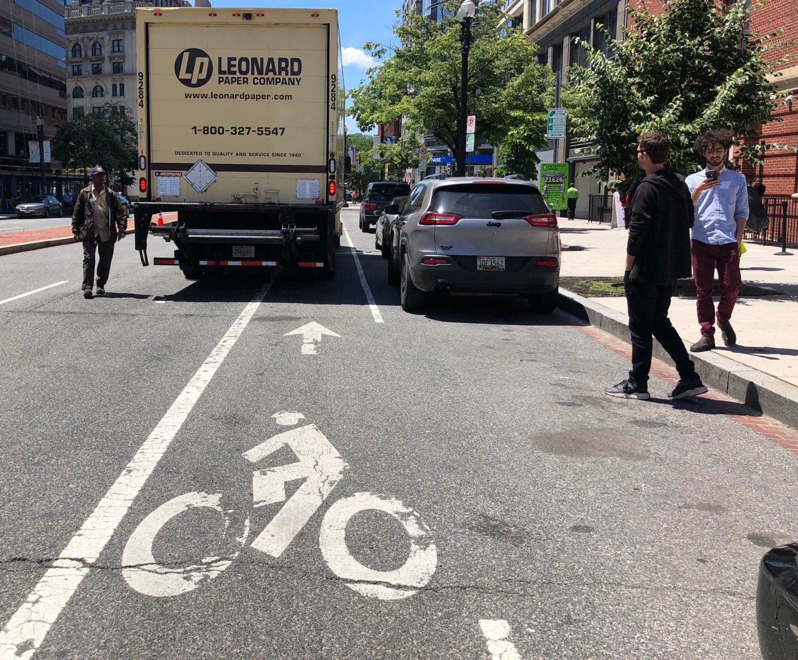
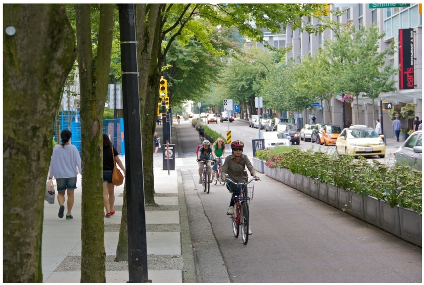

```{python}
#| label: setup
#| include: false

import pandas as pd
import geopandas as gpd
import matplotlib.pyplot as plt
import matplotlib.patches as mpatches
from matplotlib.colors import LinearSegmentedColormap
import matplotlib.ticker as mticker
import contextily as ctx
import numpy as np
from pathlib import Path

DATA = Path("data/processed")
RAW  = Path("data/raw")
FIGS = Path("figures")
FIGS.mkdir(exist_ok=True)

# Consistent city colours used throughout
CITY_COLOURS = {
    "Victoria":  "#2196F3",
    "Montreal":  "#4CAF50",
    "Toronto":   "#FF9800",
}

plt.rcParams.update({
    "font.family": "sans-serif",
    "axes.spines.top": False,
    "axes.spines.right": False,
    "figure.facecolor": "white",
})
```

::: {.callout-note appearance="simple"}
This is preliminary work based on openly available data.
It's not an official release and should not be cited as such. ✌️ 
:::

## 🚲 Intro

Cycling is one of the cheapest ways a city can expand mobility — 
but only if people feel safe using it.

Painted lanes on busy roads do very little for overall ridership.
[The research on this is settled](https://doi.org/10.1080/15568318.2026.2649315){target="_blank"} -
what moves the needle is **high-comfort infrastructure**:
physically separated cycle tracks, multi-use paths, and local street 
bikeways. Places where you don't have to negotiate with a fast moving car.

Between 2019 and 2024, Canadian cities added hundreds of kilometres
of cycling infrastructure. Not all of it was equal.

:::{.photo-pair}



:::

Using two national snapshots -
a 2019 baseline **[cycling infrastructure dataset](https://health-infobase.canada.ca/datalab/bicycling-infrastructure.html){target="_blank"}**
from the Public Health Agency and
the 2024 **[Canadian Cycling Network Database](https://www150.statcan.gc.ca/n1/pub/23-26-0004/232600042024001-eng.htm){target="_blank"}**
from Statistics Canada - 
we measured how access to high-comfort infrastructure changed
across three cities: Victoria, Montreal, and Toronto.

**TL;DR:** Victoria punches way above its weight.
Montreal has made real gains.
Toronto has been.. sluggish.

---

---

## 🏷️ Classification is hard

Here's a problem that doesn't get sufficient air time in cycling research:
municipalities have wildly inconsistent names for their infrastructure.

One city's "bike lane" is a 50cm wide faded stripe in the door zone.
Another's is a fully protected cycle track with a physical barrier.

This matters because the raw data reflects whatever label
each municipality choses to use —
not a consistent description of what was actually built.

{width=100%}


### How we resolved it

We used **[Can-BICS](https://www.canada.ca/en/public-health/services/reports-publications/health-promotion-chronic-disease-prevention-canada-research-policy-practice/vol-40-no-9-2020/canbics-classification-system-naming-convention-cycling-infrastructure.html){target="_blank"}**
(Canadian Bikeway Comfort and Safety) as a common framework.
Can-BICS classifies cycling infrastructure into three comfort tiers
based on physical separation from motor traffic:
*high*, *medium*, and *low*.
This analysis focuses on the high-comfort tier —
the facilities with genuine physical separation
that [research shows actually shift ridership](https://doi.org/10.1186/s12966-025-01767-y){target="_blank"}.

To apply Can-BICS consistently, we verified classifications
using **Google Street View**, checking ambiguous segments
in each city against what was actually on the ground.

---

## 📍 How do we measure spatial access?

We measure access at the **[dissemination block (DB)](https://www150.statcan.gc.ca/n1/pub/92-195-x/2021001/geo/db-id/db-id-eng.htm){target="_blank"}** 
level, Statistics Canada's smallest geographic unit with population counts.
There are thousands of them per city.
For each one, we ask: **is there high-comfort infrastructure nearby?**

```{python}
#| label: method-diagram
#| fig-cap: "Check! ✅ This dissemination block in Montreal's Plateau neighbourhood contains high comfort infrastructure within 300m of its centroid."
#| out-width: 100%
#| fig-dpi: 96

METRIC_CRS = "EPSG:3347"
PLOT_CRS   = "EPSG:3857"
BUFFER_M   = 300
FIG_W, FIG_H = 6, 3.5

# --- Load pre-extracted GeoJSONs (committed to git) ---
block      = gpd.read_file("data/example_block.geojson").to_crs(METRIC_CRS)
network_hc = gpd.read_file("data/example_network.geojson").to_crs(METRIC_CRS)
centroid   = block.geometry.iloc[0].centroid
buffer     = centroid.buffer(BUFFER_M)

# --- Reproject everything to Web Mercator for contextily ---
block_plot    = block.to_crs(PLOT_CRS)
buffer_plot   = gpd.GeoSeries([buffer], crs=METRIC_CRS).to_crs(PLOT_CRS)
centroid_plot = gpd.GeoSeries([centroid], crs=METRIC_CRS).to_crs(PLOT_CRS)
network_plot  = network_hc.to_crs(PLOT_CRS)

# --- Compute landscape-friendly axis limits ---
bx0, by0, bx1, by1 = buffer_plot.total_bounds
data_w  = bx1 - bx0
data_h  = by1 - by0
# Expand whichever dimension needs growing to hit the target aspect ratio
target_aspect = FIG_W / FIG_H
if data_w / data_h < target_aspect:
    data_w = data_h * target_aspect
else:
    data_h = data_w / target_aspect
cx_mid  = (bx0 + bx1) / 2
cy_mid  = (by0 + by1) / 2
pad     = 0.15
xlim    = (cx_mid - data_w / 2 * (1 + pad), cx_mid + data_w / 2 * (1 + pad))
ylim    = (cy_mid - data_h / 2 * (1 + pad), cy_mid + data_h / 2 * (1 + pad))

fig, ax = plt.subplots(figsize=(FIG_W, FIG_H))

# Data layers
buffer_plot.plot(ax=ax, facecolor="#2196F3", alpha=0.15,
                 edgecolor="#2196F3", linewidth=1.5, linestyle="--", zorder=2)
block_plot.plot(ax=ax, facecolor="none", edgecolor="#333",
                linewidth=1.5, zorder=3)
network_plot.plot(ax=ax, color="#4CAF50", linewidth=2.5, zorder=4)
centroid_plot.plot(ax=ax, color="#2196F3", markersize=60, zorder=5)

ax.set_xlim(xlim)
ax.set_ylim(ylim)

# Basemap last — zoom=17 gives sharp tiles at neighbourhood scale
ctx.add_basemap(ax, source=ctx.providers.CartoDB.Positron, zoom=17)

ax.set_axis_off()

# Simple legend
hc_line   = mpatches.Patch(color="#4CAF50", label="High-comfort segment")
buf_patch = mpatches.Patch(facecolor="#2196F3", alpha=0.3,
                           edgecolor="#2196F3", label="300 m buffer")
dot       = plt.Line2D([0], [0], marker="o", color="w",
                       markerfacecolor="#2196F3", markersize=9,
                       label="Block centroid")
# Legend inside the axes — avoids adding width outside the map boundary
ax.legend(handles=[hc_line, buf_patch, dot],
          loc="lower right", frameon=True, fontsize=8,
          framealpha=0.9, bbox_to_anchor=(1.0, 0.0))

plt.tight_layout(pad=0)
plt.savefig(FIGS / "method_diagram.png", dpi=96, bbox_inches="tight")
plt.show()
```

For each DB centroid $i$, we compute a binary access indicator:

$$
a_i = \begin{cases}
  1 & \text{if } d(i,\ \text{nearest high-comfort segment}) \leq 300\text{ m} \\
  0 & \text{otherwise}
\end{cases}
$$

Then roll it up to a city-level **population-weighted access share**:

$$
A = \frac{\sum_i p_i \cdot a_i}{\sum_i p_i}
$$

where $p_i$ is the 2021 census population of block $i$.
Dense blocks count more: a gain in a high-rise neighbourhood
outweighs the same gain in a low-density suburb. 

### Why 300 m?

300 m is roughly a 4-minute walk,
and a [well-established threshold](https://www150.statcan.gc.ca/n1/pub/82-003-x/2022010/article/00001-eng.htm){target="_blank"} in transport geography
for "close enough to use."

We also tested 200 m and 500 m to confirm the story doesn't change
with the threshold. It doesn't —
city rankings are consistent across all three distances.

---

### 🏆 Victoria: the standout

Victoria is the smallest city in this analysis.
It also has the most dramatic trajectory.


Between 2019 and 2024, the share of Victoria residents within 300 m
of high-comfort infrastructure rose from **4.8% to 75.6%** —
a gain of **70.8 percentage points**.
Per capita, nothing else here comes close.

Much of the story is *conversion*, not just addition.
Victoria upgraded painted bike lanes to protected cycle tracks,
and replaced sharrows with traffic-controlled local street bikeways —
infrastructure that actually changes who feels comfortable riding.
In a compact city, the right corridors in the right places
move the numbers fast.

```{python}
#| label: victoria-map
#| fig-cap: "Victoria cycling network, 2019 vs 2024. Blue: high-comfort. Red: lower-comfort (painted lanes, sharrows, shared roads). In five years, the city flipped the balance."
#| out-width: 100%
#| fig-dpi: 96

PLOT_CRS = "EPSG:3857"

TIER_COLOURS = {
    "high": "#2196F3",  # blue
    "low":  "#E57373",  # muted red
}
TIER_MAP = {
    "cycle_track":          "high",
    "bike_path":            "high",
    "local_street_bikeway": "high",
    "multi_use_path":       "low",
    "painted_bike_lane":    "low",
    # shared_roadway / major_shared_roadway excluded
}
TIER_ORDER = ["low", "high"]   # draw low first so high is on top

def load_tiered(city, year):
    gdf = gpd.read_parquet(DATA / f"{city}_{year}.parquet").to_crs(PLOT_CRS)
    gdf["tier"] = gdf["canbics_class"].map(TIER_MAP)
    return gdf[gdf["tier"].notna()].reset_index(drop=True)

vic_2019 = load_tiered("victoria", 2019)
vic_2024 = load_tiered("victoria", 2024)

# Shared bounds from combined extent
combined = pd.concat([vic_2019, vic_2024])
bx0, by0, bx1, by1 = gpd.GeoDataFrame(combined, geometry="geometry").total_bounds
xpad = (bx1 - bx0) * 0.04
ypad = (by1 - by0) * 0.04
xlim = (bx0 - xpad, bx1 + xpad)
ylim = (by0 - ypad, by1 + ypad)

fig, axes = plt.subplots(1, 2, figsize=(10, 5))

for ax, gdf, year in zip(axes, [vic_2019, vic_2024], [2019, 2024]):
    for tier in TIER_ORDER:
        subset = gdf[gdf["tier"] == tier]
        lw = 1.8 if tier == "high" else 0.8
        subset.plot(ax=ax, color=TIER_COLOURS[tier], linewidth=lw, zorder=TIER_ORDER.index(tier)+2)
    ax.set_xlim(xlim)
    ax.set_ylim(ylim)
    ctx.add_basemap(ax, source=ctx.providers.CartoDB.Positron, zoom=13)
    ax.set_axis_off()
    ax.set_title(str(year), fontsize=12, pad=6, fontfamily="sans-serif")

# Shared legend on the right panel
legend_handles = [
    mpatches.Patch(color=TIER_COLOURS["high"], label="High comfort"),
    mpatches.Patch(color=TIER_COLOURS["low"],  label="Lower comfort"),
]
axes[1].legend(handles=legend_handles, loc="lower right",
               frameon=True, fontsize=8, framealpha=0.9)

plt.tight_layout(pad=0.5)
plt.savefig(FIGS / "victoria_map.png", dpi=96, bbox_inches="tight")
plt.show()
```

---

### 🥯 Montreal: real gains, real network

Montreal has the largest absolute high-comfort network of the three cities.
And it kept growing.

Between 2019 and 2024, population-weighted access rose from
**64.0% to 69.2%** — a smaller percentage-point gain than Victoria,
but from a much higher base, and across a city of 1.6 million.

Central to this: the **REV** — Réseau Express Vélo.
A set of high-frequency protected lanes built explicitly as
cycling rapid transit, not recreational paths. That framing matters.

```{python}
#| label: montreal-map
#| fig-cap: "Montreal cycling network, 2019 vs 2024. Blue: high-comfort. Red: lower-comfort. REV corridors visible as high-density additions in central arrondissements."
#| out-width: 100%
#| fig-dpi: 96

mtl_2019 = load_tiered("montreal", 2019)
mtl_2024 = load_tiered("montreal", 2024)

combined  = pd.concat([mtl_2019, mtl_2024])
bx0, by0, bx1, by1 = gpd.GeoDataFrame(combined, geometry="geometry").total_bounds
xpad, ypad = (bx1-bx0)*0.03, (by1-by0)*0.03
xlim, ylim = (bx0-xpad, bx1+xpad), (by0-ypad, by1+ypad)

fig, axes = plt.subplots(1, 2, figsize=(12, 6))

for ax, gdf, year in zip(axes, [mtl_2019, mtl_2024], [2019, 2024]):
    for tier in TIER_ORDER:
        gdf[gdf["tier"] == tier].plot(ax=ax, color=TIER_COLOURS[tier],
                                      linewidth=1.4 if tier == "high" else 0.5,
                                      zorder=TIER_ORDER.index(tier)+2)
    ax.set_xlim(xlim); ax.set_ylim(ylim)
    ctx.add_basemap(ax, source=ctx.providers.CartoDB.Positron, zoom=12)
    ax.set_axis_off()
    ax.set_title(str(year), fontsize=12, pad=6, fontfamily="sans-serif")

axes[1].legend(handles=[
    mpatches.Patch(color=TIER_COLOURS["high"], label="High comfort"),
    mpatches.Patch(color=TIER_COLOURS["low"],  label="Lower comfort"),
], loc="lower right", frameon=True, fontsize=8, framealpha=0.9)

plt.tight_layout(pad=0.5)
plt.savefig(FIGS / "montreal_map.png", dpi=96, bbox_inches="tight")
plt.show()
```

The catch: Montreal is large and uneven.
Gains have concentrated in the central plateau and downtown.
Outer arrondissements have seen much less.
The city-wide number is real, but it masks a lot of geography.

---

### 🚧 Toronto: real progress, uneven delivery

Toronto did build during this period.
New cycle tracks appeared along key corridors,
and the city made genuine additions to its high-comfort network.

But for a city of 2.7 million, the population-weighted numbers
tell a more modest story: access moved from **8.9% to 16.1%** —
roughly **7.2 percentage points**.

```{python}
#| label: toronto-map
#| fig-cap: "Toronto cycling network, 2019 vs 2024. Blue: high-comfort. Red: lower-comfort. New protected lanes visible along key inner-city corridors."
#| out-width: 100%
#| fig-dpi: 96

tor_2019 = load_tiered("toronto", 2019)
tor_2024 = load_tiered("toronto", 2024)

combined  = pd.concat([tor_2019, tor_2024])
bx0, by0, bx1, by1 = gpd.GeoDataFrame(combined, geometry="geometry").total_bounds
xpad, ypad = (bx1-bx0)*0.03, (by1-by0)*0.03
xlim, ylim = (bx0-xpad, bx1+xpad), (by0-ypad, by1+ypad)

fig, axes = plt.subplots(1, 2, figsize=(12, 6))

for ax, gdf, year in zip(axes, [tor_2019, tor_2024], [2019, 2024]):
    for tier in TIER_ORDER:
        gdf[gdf["tier"] == tier].plot(ax=ax, color=TIER_COLOURS[tier],
                                      linewidth=1.4 if tier == "high" else 0.5,
                                      zorder=TIER_ORDER.index(tier)+2)
    ax.set_xlim(xlim); ax.set_ylim(ylim)
    ctx.add_basemap(ax, source=ctx.providers.CartoDB.Positron, zoom=12)
    ax.set_axis_off()
    ax.set_title(str(year), fontsize=12, pad=6, fontfamily="sans-serif")

axes[1].legend(handles=[
    mpatches.Patch(color=TIER_COLOURS["high"], label="High comfort"),
    mpatches.Patch(color=TIER_COLOURS["low"],  label="Lower comfort"),
], loc="lower right", frameon=True, fontsize=8, framealpha=0.9)

plt.tight_layout(pad=0.5)
plt.savefig(FIGS / "toronto_map.png", dpi=96, bbox_inches="tight")
plt.show()
```

---

### The divergence

The gap between cities is the real story.
Routes planned, deferred, reduced, or removed under political pressure
don't show up as additions — but they show up in the numbers.

```{python}
#| label: divergence
#| fig-cap: "Population-weighted share of residents within 300 m of high-comfort cycling infrastructure, 2019 and 2024. Dots sized by 2021 population."
#| out-width: 100%
#| fig-dpi: 120

from matplotlib.transforms import blended_transform_factory

access = pd.read_csv(DATA / "access.csv")
# Plot order: Victoria top, Montreal middle, Toronto bottom
order = ["Victoria", "Montreal", "Toronto"]
access["_ord"] = access["Municipality"].map({c: i for i, c in enumerate(reversed(order))})
access = access.sort_values("_ord").reset_index(drop=True)

fig, ax = plt.subplots(figsize=(8, 3.5))

for idx, row in access.iterrows():
    # Grey connector
    ax.plot([row["% nearby access 2019"], row["% nearby access 2024"]],
            [idx, idx], color="#e0e0e0", linewidth=6, solid_capstyle="round", zorder=1)
    # Arrow tip to show direction
    dx = row["% nearby access 2024"] - row["% nearby access 2019"]
    ax.annotate("", xy=(row["% nearby access 2024"], idx),
                xytext=(row["% nearby access 2019"], idx),
                arrowprops=dict(arrowstyle="-|>", color="#bdbdbd", lw=0), zorder=1)

# 2019 dots
ax.scatter(access["% nearby access 2019"], range(len(access)),
           color="#90CAF9", s=120, zorder=3, label="2019")
# 2024 dots
ax.scatter(access["% nearby access 2024"], range(len(access)),
           color="#1565C0", s=120, zorder=3, label="2024")

# Value labels
for idx, row in access.iterrows():
    ax.text(row["% nearby access 2019"] - 1.5, idx, f"{row['% nearby access 2019']:.0f}%",
            ha="right", va="center", fontsize=9, color="#90CAF9")
    ax.text(row["% nearby access 2024"] + 1.5, idx, f"{row['% nearby access 2024']:.0f}%",
            ha="left", va="center", fontsize=9, color="#1565C0")

# Population labels on far right
trans = blended_transform_factory(ax.transAxes, ax.transData)
for idx, row in access.iterrows():
    ax.text(1.02, idx, f"{int(row['Population (2021)']):,}",
            va="center", fontsize=9, color="#999", transform=trans)
ax.text(1.02, len(access) - 0.55, "Pop. (2021)",
        fontsize=9, color="#999", fontweight="bold", transform=trans)

ax.set_yticks(range(len(access)))
ax.set_yticklabels(access["Municipality"], fontsize=11)
ax.set_xlim(-2, 100)
ax.set_xticks(range(0, 101, 20))
ax.xaxis.set_major_formatter(plt.FuncFormatter(lambda x, _: f"{x:.0f}%"))
ax.set_xlabel("Residents within 300 m of high-comfort infrastructure", labelpad=10, fontsize=10)

ax.spines["top"].set_visible(False)
ax.spines["right"].set_visible(False)
ax.spines["left"].set_visible(False)
ax.spines["bottom"].set_visible(False)
ax.grid(axis="x", alpha=0.25, linestyle="--")
ax.tick_params(axis="y", length=0)

ax.legend(loc="lower right", fontsize=9, frameon=False)

plt.tight_layout()
plt.subplots_adjust(right=0.85)
plt.savefig(FIGS / "divergence.png", dpi=120, bbox_inches="tight")
plt.show()
```

---

## 🔍 Conclusion

This isn't a story about resources or city size.
It's about political choices.

Victoria and Montreal built the kind of infrastructure
the evidence says works. Toronto made progress —
but the scale of what's needed still outpaces what got delivered.

That matters beyond cycling mode share.
High-comfort networks are a transit multiplier:

- 🚌 **They extend the walkshed** around transit stops —
  critical for first/last mile in medium-density areas
  where bus frequency alone can't close the gap
- 📉 **They reduce peak-hour vehicle pressure**
  on commute corridors
- 🙋 **They reach new riders** — people who won't ride on
  painted lanes but will ride on protected ones.
  That's the mechanism behind modal shift.

The CCND will be updated again.
When it is, the question is whether the gap
between cities like Victoria and Montreal
and cities like Toronto has kept widening —
or whether the laggards have finally started catching up.

Based on what this analysis shows,
there's no reason to expect catch-up
without a real change in what actually gets built.

---

